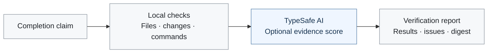

<div align="center">

# TypeSafe Agent

### Completion checks for DeepSeek Harness

Check the files. Rerun the tests. Evaluate the evidence.

[](https://github.com/gungnir-maker/typesafe-agent-dsh/actions/workflows/ci.yml)
[](LICENSE)

[Get started](#get-started) · [How it works](#how-it-works) · [Current limits](#current-limits) · [Changelog](CHANGELOG.md)

</div>

---

`typesafe-agent-dsh` adds a verification tool to [DeepSeek Harness](https://github.com/deepseek-ai/deepseek-harness). It checks completion claims against workspace changes and reruns configured commands. An optional [TypeSafe AI](https://docs.typesafe.ai/introduction/quickstart) check evaluates whether the supplied evidence supports the claim.

**Current status: advisory verifier.** The agent is prompted to request verification; completion is not yet enforced by the runtime. A passing report means the configured checks passed for the inspected state, not that every requirement is satisfied.

## How it works



The local checks inspect the workspace and execute commands. TypeSafe AI runs only when configured and local verification passes; otherwise the report returns directly. Commands and thresholds come from plugin configuration.

| Check | What it verifies |
| :--- | :--- |
| Completion contract | Required fields, reported blockers, and nonempty evidence |
| File boundaries | Normalized paths and resolved symlinks stay within the configured scope |
| Change set | Claimed changes match Git, including deletions; omitted changes are reported |
| Command execution | Configured commands are rerun with time limits and cancellation |
| Semantic evaluation · optional | TypeSafe scores the supplied evidence against configured questions |

Reports include issues, command results, semantic scores, and a workspace digest when available. Required Git collection failures produce `UNVERIFIED`; they do not silently pass.

## Get started

Requires a working DeepSeek Harness installation, Git, and Node **22.19+ on the 22.x line, or 24+**. The package uses ESM. Use a project with an existing Git commit and a clean starting tree.

### 1. Build and install

```bash
git clone https://github.com/gungnir-maker/typesafe-agent-dsh.git
cd typesafe-agent-dsh
npm ci
npm run build
dsh plugin --profile web add "file:$(pwd)"
```

### 2. Configure the project to verify

Set the plugin row in your DSH profile patch. `workspaceRoot` must point to the project the agent is working on. Choose commands that actually test that project's requirements.

```yaml
- insert:
    - id: typesafe-agent-dsh
      name: typesafe-agent-dsh
      config:
        workspaceRoot: /absolute/path/to/your-project
        allowedPathPrefixes: [src, test]
        verificationCommands: [npm test]
        commandTimeoutMs: 300000
        verifyChanges: true
        verifyComplete: true
```

Adjust `allowedPathPrefixes` to your repository layout. Change checks compare against `HEAD`, so unrelated uncommitted files are included. Use a clean starting tree.

Two independent waivers, and they are not interchangeable: `verifyChanges: false` drops change verification entirely — claimed files are then only checked for existence — while `verifyComplete: false` keeps those checks and waives only the requirement that the claim account for *every* changed path. Waiving either removes the corresponding failures from `ready`, so prefer keeping both on and starting from a clean tree.

### 3. Add TypeSafe AI · optional

Add this block inside the plugin's `config`:

```yaml
typesafe:
  apiKeyEnv: TYPESAFE_API_KEY
  model: jev-latest
  checks:
    - id: completion_is_supported
      instructions: Based only on the task and evidence, is the completion claim supported well enough to hand off?
      threshold: 0.6
```

Enter your TypeSafe key in the **TypeSafe card on DSH's Models settings page**, or set it before launching:

```bash
export TYPESAFE_API_KEY="your_typesafe_key"
dsh web
```

Your coding model remains configured in DSH. The TypeSafe key is separate from its provider key. A configured TypeSafe check fails verification if the key cannot be resolved or the service is unavailable.

> **Data sent to TypeSafe:** the supplied task, completion claim, and captured verification-command output. Review [SECURITY.md](SECURITY.md) before enabling it. Keep credentials outside this repository.

## Read the result

Ask the agent to call `typesafe_verify_task` after its changes. The tool accepts a completion claim as `resultJson` and returns a JSON-encoded verification report.

| Result | Interpretation |
| :--- | :--- |
| `ready: true` | All configured checks passed for the inspected state |
| `ready: false` | Review `issues` and the associated evidence before proceeding |
| `workspaceDigest` | A fingerprint for detecting workspace changes; freshness is not yet enforced |

<details>
<summary>Example completion claim</summary>

```json
{
  "taskId": "fix-login-validation",
  "task": "Add email validation before creating a login session and prove the test suite passes.",
  "status": "done",
  "summary": "Added email validation before creating a login session.",
  "changedFiles": ["src/login.ts", "test/login.test.ts"],
  "testsClaimed": ["npm test"],
  "blockers": []
}
```

An unclaimed required command produces `TEST_NOT_DECLARED`. A configured command exiting zero confirms execution success, not task coverage.

</details>

## Current limits

| Capability | Status |
| :--- | :--- |
| Detect omitted workspace changes | Implemented |
| Fingerprint workspace contents | Implemented; later edits do not automatically trigger verification |
| Bind evaluation to the original user request | Planned; the task text is currently supplied by the agent |
| Enforce verification before a turn completes | Planned; invocation currently relies on prompt instructions |
| Automated installed-plugin and credential-flow testing | Pending; existing DSH testing includes manual runs |

Checks compare against `HEAD`, not a task-start snapshot. They cannot attribute pre-existing edits to a particular task. A passing test command does not establish coverage, and a semantic score does not establish correctness.

The next milestone is to bind requirements and verdicts to a task, then enforce fresh verification at turn close. Codex and Claude adapters are future work.

## Calibration notes

The default semantic threshold is **0.6**. It was lowered after manual runs rejected apparently valid completions at `0.8`. These observations do **not** establish a false-acceptance rate; labeled correct and incorrect cases are still needed.

<details>
<summary>Historical observations · one repository, jev-latest</summary>

These are recorded development observations, not a reproducible benchmark. Test counts refer to the suite at the time of each run.

| Completion claim | Reported evidence | Observed score |
| :--- | :--- | ---: |
| Credential-store key resolution | 9/9 tests | 0.79 |
| Completion prompt instruction | 14/14 tests | 0.77 |
| New README section | 18/18 tests | 0.61–0.70 |
| One-line README addition | 18/18 tests | 0.70 |
| Claim without a configured command | No command evidence | 0.48 |

Repeated scoring varied. Documentation changes also require different evidence from code changes: a passing code test suite does not verify prose. Tune thresholds against labeled examples from your own workflow.

The earlier README recorded a refusal at **0.79 against a 0.8 threshold**. That illustrates the previous configuration, not the current default.

</details>

## Development

```bash
npm run check
npm test
npm run build
```

CI runs on Node 22 and 24. Unit and mock tests are distinct from live DSH integration testing.

<details>
<summary>Integration details</summary>

- The Host registers `typesafe_verify_task` and a completion prompt section.
- `client/index.js` is the shipped browser bundle. It mounts a card in `settings.models.footer` using DSH's credential Remote; no client build step is needed.
- Credentials resolve through `ctx.credentials.resolve`. `process.env` is the fallback when no credential service is mounted. The browser receives credential status, not the stored value.
- The tracked integration points for future enforcement are `agent/inbox/claimed`, `session/event`, and `agent/turn-stopping`. Their use for requirement binding and completion enforcement is not implemented here yet.

</details>

---

[MIT license](LICENSE) · [Security and data handling](SECURITY.md) · [Changes](CHANGELOG.md) · [Report an issue](https://github.com/gungnir-maker/typesafe-agent-dsh/issues)
